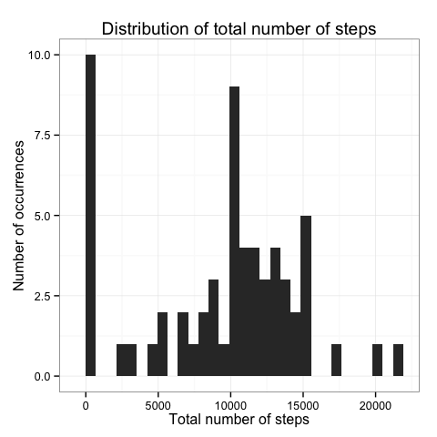
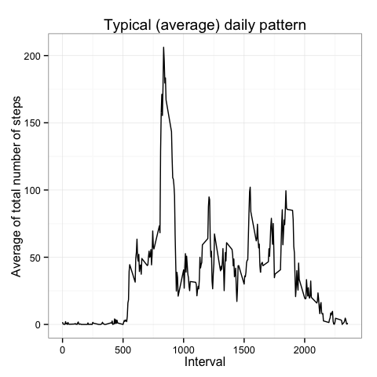
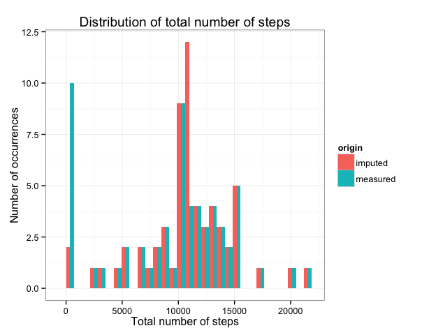
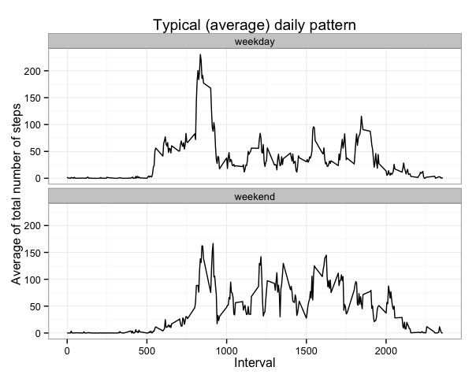

# Reproducible Research: Peer Assessment 1
AAGP80  
12 ottobre 2015  


## Requirements and options
The following R packages are needed:


```r
require(lubridate)
require(dplyr)
require(ggplot2)
require(xtable)

options(scipen = 1)
```

scipen=1 is used to avoid scientific notation


## Loading and preprocessing the data
It is supposed that the file activity.csv is in the same folder of this Rmd file.
The following lines load the data and convert properly the dates.


```r
activity<-read.csv("activity.csv",stringsAsFactors = FALSE)
activity$date<-ymd(activity$date)
```


## What is mean total number of steps taken per day?
In order to answer to this question, the dataset has been grouped by date and it was calculated the total number of steps taken per day ignoring NA values.


```r
activity_by_date<-group_by(activity,date)
tot_steps_by_date<-summarise(activity_by_date,number=sum(steps,na.rm=TRUE))
```

The following figure shows the distribution of the total number of steps taken each day


```r
ggplot(tot_steps_by_date, aes(x=number))+
        geom_histogram()+
        labs(title="Distribution of total number of steps",
             x="Total number of steps",
             y="Number of occurrences")+
        theme_bw()
```

 

The following table summarize the mean and the median (rounded values) of the previous distribution.

 Parameter | Value
 ------------- | -------------
 Mean          | 9354.2 
 Median        | 10395


## What is the average daily activity pattern?
In order to answer to this question the dataset has been grouped by interval and it was calculated the mean of the total steps per interval ignoring NA values.


```r
activity_by_int<-group_by(activity,interval)
avg_steps_by_int<-summarise(activity_by_int,avg=mean(steps,na.rm=TRUE))
```

The following figure shows the average number of steps per interval considerin all days. The five minute acquisition intervals are to be read in the following way:

* 0 = 00:00
* 1000 = 10:00
* 20000 = 20:00


```r
ggplot(avg_steps_by_int, aes(interval,avg))+
        geom_line()+
        labs(title="Typical (average) daily pattern",
             x="Interval",
             y="Average of total number of steps")+
        theme_bw()
```

 

Interval 835 (i.e. 08:35) contains the maximum number of steps.


## Imputing missing values
The following table shows that NAs values are grouped together and entire days are missing.


```r
tot_NA_by_date<-summarise(activity_by_date,number.of.NA=sum(is.na(steps)))
xt<-filter(tot_NA_by_date,number.of.NA!=0)
xt$date<-as.character(xt$date)
xt<-xtable(xt)
print(xt, type="html",include.rownames=FALSE, html.table.attributes = getOption("xtable.html.table.attributes","border=0"))
```

<!-- html table generated in R 3.2.2 by xtable 1.7-4 package -->
<!-- Wed Oct 14 23:10:33 2015 -->
<table border=0>
<tr> <th> date </th> <th> number.of.NA </th>  </tr>
  <tr> <td> 2012-10-01 </td> <td align="right"> 288 </td> </tr>
  <tr> <td> 2012-10-08 </td> <td align="right"> 288 </td> </tr>
  <tr> <td> 2012-11-01 </td> <td align="right"> 288 </td> </tr>
  <tr> <td> 2012-11-04 </td> <td align="right"> 288 </td> </tr>
  <tr> <td> 2012-11-09 </td> <td align="right"> 288 </td> </tr>
  <tr> <td> 2012-11-10 </td> <td align="right"> 288 </td> </tr>
  <tr> <td> 2012-11-14 </td> <td align="right"> 288 </td> </tr>
  <tr> <td> 2012-11-30 </td> <td align="right"> 288 </td> </tr>
   </table>

The total number of NA values in the dataset is 2304 (i.e. 288 intervals x 8 days).

Since the presence of NA values may introduce bias into some calculations, it was chosen to impute to them the typical (average) number of steps for each missing interval.
As first step a new dataset is created: 

```r
activity_imp<-activity
```

then missing values are imputed:


```r
for (i in 1:nrow(activity_imp)) {
         if (is.na(activity_imp$steps[i])) {
                 activity_imp$steps[i] <- avg_steps_by_int[
                         which(activity_imp$interval[i] == 
                                       avg_steps_by_int$interval), ]$avg
        }
 }
```

As before the imputed dataset has been grouped by date and it was calculated the total number of steps taken per day


```r
activity_imp_by_date<-group_by(activity_imp,date)
tot_steps_imp_by_date<-summarise(activity_imp_by_date,
                                 number=sum(steps))
```

after that a tidy dataset with the measured distribution and the imputed one is created. The first column of the "combined" dataset contains the total number of steps, and the second the origin (measured or imputed).


```r
measured<-as.data.frame(tot_steps_by_date$number)
measured$origin <- 'measured'
names(measured)<-c("number","origin")

imputed<-as.data.frame(tot_steps_imp_by_date$number)
imputed$origin <- 'imputed'
names(imputed)<-c("number","origin")

combined<-rbind(measured, imputed)
```

This tidy dataset is used for the distribution plot:


```r
ggplot(combined, aes(x=number, fill=origin))+
        geom_histogram(position="dodge")+
        labs(title="Distribution of total number of steps",
             x="Total number of steps",
             y="Number of occurrences")+
        theme_bw()
```

 

The following table summarize the mean and the median (rounded) of the previous distributions. The imputation affected both the mean and the median.

 Parameter  | Value before imputation | Value after imputation
 ------------- | ------------- | -------------
 Mean          | 9354.2 | 10766.2
 Median        | 10395 | 10766.2

## Are there differences in activity patterns between weekdays and weekends?

To answer to this question it was created a new factor variable (weekfactor) in the imputed dataset with two levels : “weekday” and “weekend” 


```r
activity_imp<-mutate(activity_imp,
                     weekfactor=ifelse(weekdays(date,abbreviate=TRUE)=="Lun" |
                                    weekdays(date,abbreviate=TRUE)=="Mar" |
                                    weekdays(date,abbreviate=TRUE)=="Mer" |
                                    weekdays(date,abbreviate=TRUE)=="Gio" |
                                    weekdays(date,abbreviate=TRUE)=="Ven",
                                        "weekday","weekend")) %>%
        mutate(weekfactor=as.factor(weekfactor))
```

then the dataset was grouped by weekfactor and interval. After that it was calculated the mean of the number of steps for each interval.


```r
activity_imp_by_weekfactor_by_int<-group_by(activity_imp,weekfactor,interval)

avg_steps_by_weekfactor_by_int<-summarise(activity_imp_by_weekfactor_by_int,
                                     avg=mean(steps))
```

The following plot shows the comparison of activity pattern in weekday and weekend


```r
ggplot(avg_steps_by_weekfactor_by_int, aes(interval,avg))+
        geom_line()+
        facet_wrap(~weekfactor,ncol=1)+
        labs(title="Typical (average) daily pattern",
             x="Interval",
             y="Average of total number of steps")+
        theme_bw()
```

 

As it can be seen the activity in week day start earlier and after a peak before 10:00 reduces between around 20 and 100 steps per 5 minutes. On the other hand during weekend the activity begin later but is higher with values between around 50 and 150 steps per 5 minutes. 
